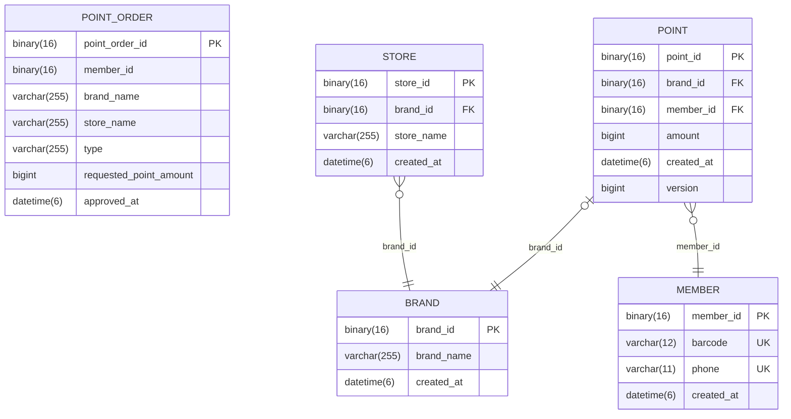
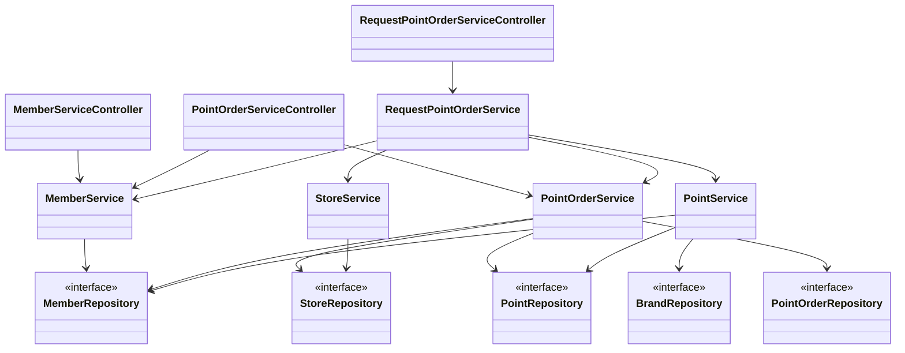

# F&B 회원 서비스 🍜 🍰 ☕️

## 프로젝트 소개

F&B 회원 관리 서비스입니다.  
Springboot 기반의 애플리케이션을 직접 구현하며, 개발에 필요한 내용을 공부하고 마주한 문제를 고민하고 해결한 내용을 기록합니다.  
기능이 추가되거나 개선된 내용은 꾸준히 업데이트 됩니다.

## 🗂️ 목차
* [구현 기능](#function)
  * [서비스 설명](#serviceinfo)
  * [구현 API 설명](#apiinfo)
  * [추가 고려사항](#considerations)
* [설계 및 구조](#architect)
   * [ERD](#erd)
   * [클래스 다이어그램](#classdiagram)
* [개선 사항](#improvement)
  * [ 🔗 1.PointOrderServiceController의 조회 API에 Pageable을 노출하는 것에 대한 고민](/documents/refactorings/1.PointOrderServiceController의_조회_API에_Pageable을_노출하는_것에_대한_고민.md)

## 🛠️ 구현 기능 <a id="function" />
### 1. 서비스 설명 <a id="serviceinfo" />
* F&B 회원의 적립 포인트를 관리하기 위한 서비스
* F&B 회원은 사용자의 휴대폰 전화번호 별로 하나의 바코드를 발급
* F&B 내 총 3가지 종류의 브랜드(MOONBUCKS, SEOULBAGUETTE, BURGERQUEEN)가 존재함
* 점포는 점포명과 위 3가지 브랜드 중 하나의 정보를 갖으며, 같은 브랜드 끼리는 적립금을 공유함
* 회원 바코드 정보 혹은 전화번호를 통해 가족 혹은 친구끼리 공유 가능
* 점포가 새로 개점하거나 폐업하는 경우, 그리고 브랜드를 변경하는 상황은 존재하지 않다고 가정
* F&B 회원이 회원 정보를 변경하거나 탈퇴하는 경우는 없으며 회원 정보의 제한된 유효기간 또한 존재하지 않음

### 2. 구현 API 설명 <a id="apiinfo" />
1) 회원 가입 API
    * 회원 전화번호를 요청값으로 받음, 회원 가입 시 바코드를 발급함
    * 전화번호는 10~11자리 문자열이며 010으로만 시작하며 유일함 (ex. 0101234567, 01012345678)
    * 바코드는 12자리 숫자로된 문자열이며 유일하고, 바코드의 생성로직은 예측이 불가능해야함
    * 이미 가입된 회원일 경우, 기존 바코드를 반환함

     

2) 포인트 적립 API
    * 적립 요청 시, 회원 정보(전화번호 or 바코드)와 점포 정보(ID) 그리고 적립 금액을 전달되어야 함
    * 같은 브랜드의 점포는 브랜드별 적립금에 통합 적립이 가능함
    * 올바르지 않은 회원 정보에 대한 오류 처리 (올바르지 않은 회원 오류 반환)
    * 올바르지 않은 점포 정보에 대한 오류 처리 (올바르지 않은 점포 오류 반환)

     

3) 포인트 사용 API
    * 회원 정보(전화번호 or 바코드)와 점포 정보(ID) 그리고 사용할 적립 금액을 요청값으로 받음
    * 같은 브랜드의 점포의 경우, 브랜드별 통합 적립금을 사용할 수 있음
    * 적립금액을 초과하여 사용하는 경우, 포인트 부족 오류 처리
    * 올바르지 않은 회원 정보에 대한 오류 처리 (올바르지 않은 회원 오류 반환)
    * 올바르지 않은 점포 정보에 대한 오류 처리 (올바르지 않은 점포 오류 반환)

     

4) 포인트 적립/사용 조회 API
    * 회원 정보(전화번호 or 바코드)와 조회 기간(시작~종료)을 요청값으로 받음
    * 요청 시간, 적립/사용 여부, 적립 점포명, 적립 브랜드명, 요청 포인트 금액을 응답값으로 전달
    * 올바르지 않은 회원 정보에 대한 오류 처리 (올바르지 않은 회원 오류 반환)

### 3. 추가 고려사항 <a id="considerations" />
1. 여러 서버에서 여러 인스턴스를 통해 동작할 수 있어야 함
2. 회원 정보(전화번호 or 바코드)는 공유가 가능하기 때문에 동시다발적으로 적립 및 사용 요청이 발생할 수 있음

## 🏗️ 설계 및 구조 <a id="architect" />
### ERD <a id="erd" />
자세한 내용은 [🔗 entity_diagram_2023-04-09.md](documents/diagrams/entity_diagram_2023-04-09.md) 파일을 참고하세요.

### 클래스 다이어그램 <a id="classdiagram" />
Controller - Service - Repository  세 레이어의 위치한 클래스 관계를 나타냅니다.  
자세한 내용은 [🔗 class_diagram_2023-03-23.md](documents/diagrams/class_diagram_2023-03-23.md) 파일을 참고하세요.

## 🚀 개선 사항 <a id="improvement"/>
프로젝트를 진행하며 기능을 추가하거나 코드를 개선한 내용을 작성한 문서입니다. 문제 상황에 대해서 고민하고 해결한 내용을 기록합니다.   
자세한 내용은 아래 링크를 참고하세요.

1. 🔗 [PointOrderServiceController의 조회 API에 Pageable을 노출하는 것에 대한 고민](/documents/refactorings/1.PointOrderServiceController의_조회_API에_Pageable을_노출하는_것에_대한_고민.md)