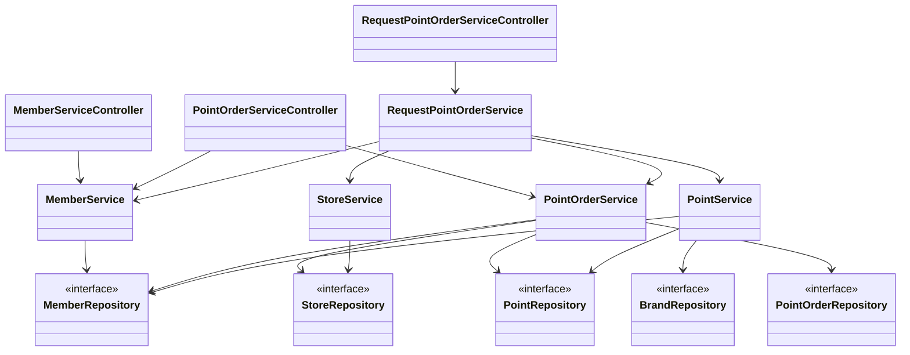

# Class Diagram
fnb-membership Class Diagram 입니다. (2023-03-23 기준)

## Diagram
Controller - Service - Repository  세 레이어의 위치한 클래스 관계를 나타냅니다.
(Entity Class와의 관계는 생략되었습니다. Entity는 각 Repository와 해당 Repository를 참조하는 Service 클래스에 의존관계를 갖습니다.)

## 클래스 설명
fnb-membership은 Controller - Service - Repository 세 Layer로 구분되는 Layered Architecture로 구성되어 있습니다.

### Controller

1. MemberServiceController
    * 신규 회원 가입을 위한 REST API를 제공합니다.
2. PointOrderServiceController
    * 포인트 적립/사용 요청 기록 조회를 위한 REST API를 제공합니다. (페이징 사용)
3. RequestPointOrderServiceController
    * 포인트 적립/사용 요청을 위한 REST API를 제공합니다.

### Service

1. MemberService
    * 회원 정보(휴대전화번호, 바코드)를 통해 회원을 조회하는 API를 제공합니다.
    * 신규 회원 가입 API를 제공합니다.

2. PointService
    * 브랜드 별 회원의 포인트 적립/사용 API를 제공합니다.
    * 낙관적락 방식으로 포인트 적립/사용 요청의 동시성을 제어합니다. (락 취득 실패 시, 요청 실패 처리)

3. PointOrderService
    * 회원의 포인트 적립/사용 요청 기록하는 API를 제공합니다.
    * 회원의 포인트 적립/사용 요청 기록을 조회하는 API를 제공합니다.

4. StoreService
    * 점포를 조회하는 API를 제공합니다.

5. RequestPointOrderService
    * 회원 정보(휴대전화번호, 바코드)를 통해 브랜드 별 회원의 포인트 적립/사용을 요청하고, 해당 요청을 기록하는 API를 제공합니다.
    * MemberService, PointService, PointOrderService, StoreService를 참조하여, 각 서비스의 API를 사용합니다.

### Repository

1. MemberRepository
    * Member entity의 CRUD API를 제공합니다.

2. PointRepository
    * Point entity의 CRUD API를 제공합니다.
    * 포인트 적립/사용 요청을 위한 Point entity 조회 시, 낙관적락을 사용해 조회합니다. (Point entity의 version property 사용)

3. PointOrderRepository
    * PointOrder entity의 CRUD API를 제공합니다.

4. StoreRepository
    * Store entity의 CRUD API를 제공합니다.