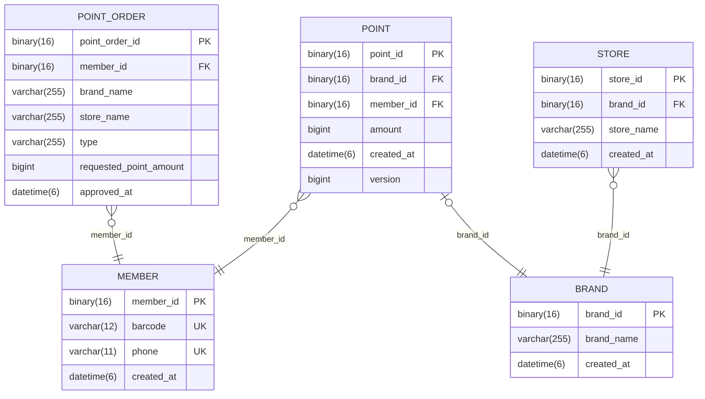

# fnb-membership ERD
fnb-membership의 ERD 입니다. (2023-03-23 기준)

## Diagram

## 테이블 설명

|테이블명|내용|
|--|--|
|member|가입된 회원 정보를 저장|
|brand|등록된 브랜드 정보를 저장|
|store|등록된 점포 정보를 저장|
|point|각 회원에 대한 브랜드 별 적립 포인트 정보를 저장|
|point_order|포인트 사용/적립 요청 정보를 저장|

## 연관관계

|관계|내용|설명|
|--|--|--|
|member - point|1:N|회원 하나당 브랜드 별 적립 포인트를 갖음|
|point - brand|N:1|브랜드 하나당 여러 회원의 적립 포인트를 갖음|
|brand - store|1:N|브랜드 하나당 여러 점포를 갖음|
|member - point_order|1:N|한 회원은 다수의 포인트 사용/적립 요청 기록을 갖음|

## 특이사항

* point_order 테이블은 회원의 포인트 사용/적립 요청 기록을 저장하기 위한 테이블로 단순 히스토리성 데이터이다. 따라서, member 테이블의 member_id로만 연관관계를 맺고 brand와 store와는 연관관계를 맺지 않고 각 테이블의 brand_name과 store_name만 저장하도록 설계했다.
* point 테이블의 version 컬럼은 포인트 사용과 적립의 동시성 문제 해결을 위해 낙관적락을 사용하기 위해 만들었다.