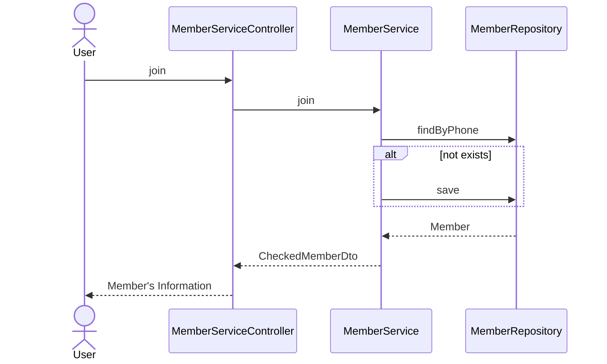
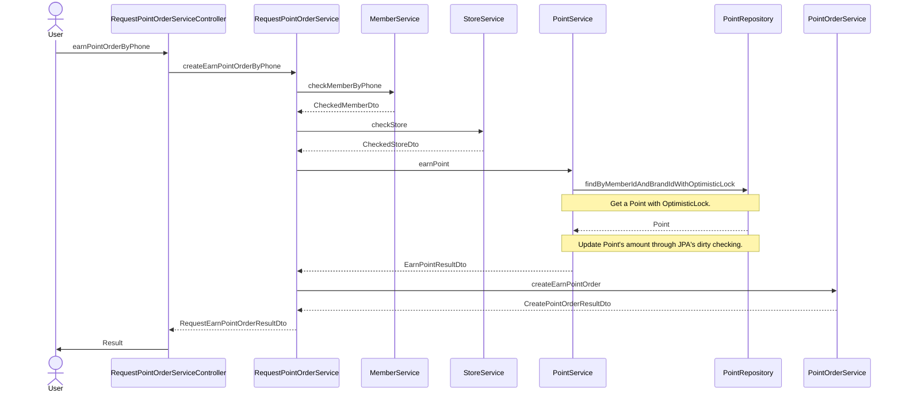
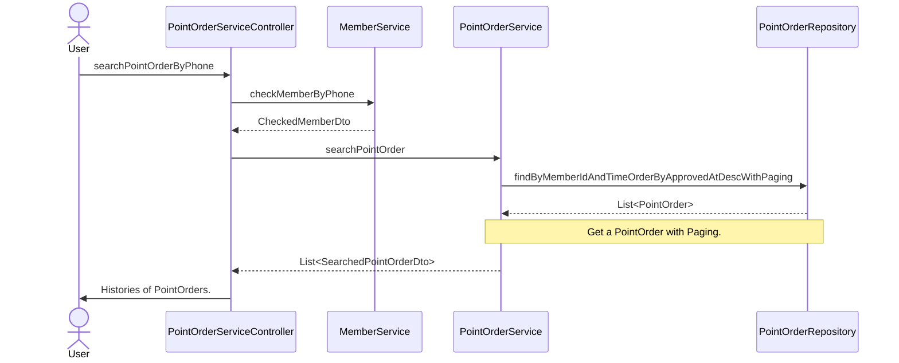

# fnb-membership ERD
fnb-membership의 Sequence Diagram 입니다. (2023-04-10 기준)

## Diagram
### 1. 회원 가입 API
회원 가입 시 회원 정보를 통해 회원 가입 여부를 확인하고 기존 회원이 존재할 경우, 그 결과를 반환합니다.
가입된 회원이 없을 경우, 회원 가입을 진행합니다.

### 2. 포인트 적립 API
포인트 적립 요청은 회원의 전화번호 또는 바코드 정보를 통해 이루어집니다.
아래 diagram은 전화번호를 통한 요청 과정이며, 바코드를 통한 요청 과정도 이와 동일하여 생략합니다.  
Point는 낙관적락을 통해 조회하며, JPA dirty checking을 통해 적립금을 업데이트 합니다. 이를 통해 포인트 적립/사용에 대한 동시성 문제를 해결합니다.  
(MemberRepository, StoreRepository, PointOrderRepository는 생략되었습니다. )  
(사용 메서드 명과 DTO에 Phone 대신 Barcode를 사용)

### 3. 포인트 사용 API
포인트 적립 사용은 회원의 전화번호 또는 바코드 정보를 통해 이루어집니다.
아래 diagram은 전화번호를 통한 요청 과정이며, 바코드를 통한 요청 과정도 이와 동일하여 생략합니다.  
Point는 낙관적락을 통해 조회하며, JPA dirty checking을 통해 적립금을 업데이트 합니다. 이를 통해 포인트 적립/사용에 대한 동시성 문제를 해결합니다.  
(MemberRepository, StoreRepository, PointOrderRepository는 생략되었습니다. )  
(사용 메서드 명과 DTO에 Phone 대신 Barcode를 사용)

### 4. 포인트 적립/사용 조회 API
포인트 적립/사용 조회는 회원의 전화번호 또는 바코드 정보를 통해 이루어집니다.
아래 diagram은 전화번호를 통한 요청 과정이며, 바코드를 통한 요청 과정도 이와 동일하여 생략합니다.
조회 기능은 페이징 처리가 된 결과를 제공합니다.
