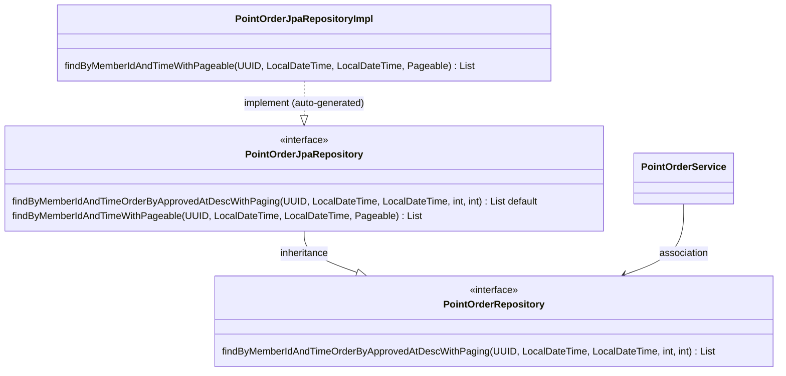

# 1. PointOrderServiceController의 조회 API에 Pageable을 노출하는 것에 대한 고민
## 요약
(이 내용은 아래 commit에서 개선되었습니다.)  
[commit ID:507598e](https://github.com/yoonpunk/fnb-membership/commit/507598e2ffc2ce83dba3e1ba12842c50a1abb4fe)

데이터 조회 용 RESTAPI에 페이징 기능을 제공하기 위해 Pageable 객체를 직접 노출해 아래와 같은 문제가 발생할 가능성이 생김.
(제공 기능: approvedAt 컬럼 기준 내림차순으로 페이징 처리. page, size만 queryParam으로 받아 처리하고자 함)

1. endpoint에 Pageable이 노출되어 페이지 설정 외 정렬 기능도 외부에 노출되는 문제가 발생함
2. 페이지 size에 매우 큰 값이 요청된다면, DB와 서버 성능에 문제가 발생할 수 있음
3. Controller -> Service -> JpaRepository의 순서로 Pageable 객체를 각 메서드의 파라미터로 계속 전달하므로써 Service Layer(순수한 비지니스 로직)이 있는 영역이 Controller와 JPA의 등의 프레임워크가 제공하는 인프라 기술에 의존하는 문제가 생김

위 세 문제를 해결하기 위해, 다음과 같은 방법으로 코드를 개선하고자 함

1. controller 메서드의 파라미터에서 Pageable 대신 page와 size값만 받을 수 있도록 변경 => Pageable 노출로 인한 문제 해결
2. size 값에 대한 최대값 제한 => size 값이 매우 커서 발생하는 성능상 문제를 해결
3. Service 메서드의 파라미터에서도 Pageable 대신 page와 size 값만 받을 수 있도록 변경 => Service가 인프라 기술에 의존하는 것을 방지
4. JpaRepository에 독립적인 PointOrderRepository 인터페이스를 만들고 PointOrderService가 이를 의존 => Servicer가 JPA 기술에 의존하지 않도록 변경

이를 통해, RESTAPI에 Pageable이 노출되어 발생하는 문제를 없애고, 해당 순수 비지니스 로직이 JPA와 Pageable같은 framework가 제공하는 인프라 기술에 독립적일 수 있도록 만듦.

자세한 사항은 아래 내용을 참고해주세요.

## 문제 상황
회원의 포인트 적립/사용 내역을 조회하는 RESTAPI에서 다음과 같은 이유로 아래 코드와 같이 Pageable을 사용하도록 개발했습니다.
* PointOrder의 approvedAt(승인 시간) 컬럼을 기준으로 내림차순으로 정렬하는 페이징 기능을 제공하기 위해
* URL의 queryParam으로 전달되어 오는 page, size 그리고 sort 정보를 springboot에서 생성해주는 Pageable을 바로 사용하기 위해
* 전달 받은 Pageable 객체를 Service 단을 통해 그대로 Repository 단에 전달하여 JpaRepository의 페이징 기능에 사용하기 위해

```java
// PointOrderServiceController.java
@GetMapping("pointorder/{phone}/byphone")
public ResponseEntity<SearchPointOrderByPhone.Response> searchPointOrderByPhone(
        @PathVariable String phone,
        @RequestParam @DateTimeFormat(iso = DateTimeFormat.ISO.DATE_TIME) LocalDateTime startTime,
        @RequestParam @DateTimeFormat(iso = DateTimeFormat.ISO.DATE_TIME) LocalDateTime endTime,
        @PageableDefault(size=100, sort="approvedAt", direction = Sort.Direction.DESC) Pageable pageable) {

    log.info("searchPointOrderByPhone requested. phone=" + phone);

    try {
        CheckedMemberDto checkedMemberDto = memberService.checkMemberByPhone(phone);

        SearchPointOrderDto searchPointOrderDto = SearchPointOrderDto.builder()
                .memberId(checkedMemberDto.getId())
                .startTime(startTime)
                .endTime(endTime)
                .pageable(pageable)
                .build();

        Slice<SearchedPointOrderDto> searchedPointOrderDtos = pointOrderService.searchPointOrder(searchPointOrderDto);
        
    // 생략 ...
}
```

스프링부트(framework)가 제공해주는 기능을 통해 url로 전달되어 오는 queryParameter를 Pageable 객체로 받았고, 이를 PointOrderService 객체를 통해 최종적으로 PointOrder를 조회해오는 PointOrderRepository의 메서드 파라미터로 Pageable 객체를 그대로 전달해 PointOrder를 조회했습니다.

```java
// PointOrderService.java
public Slice<SearchedPointOrderDto> searchPointOrder(SearchPointOrderDto searchPointOrder) {
    
    // 생략 ...
    
    Slice<PointOrder> sliceByMemberId = pointOrderRepository.findSliceByMemberIdAndTime(
            UUID.fromString(searchPointOrder.getMemberId()),
            searchPointOrder.getStartTime(),
            searchPointOrder.getEndTime(),
            searchPointOrder.getPageable()
    );
    
    // 생략 ...
}

// PointOrderRepository.java
@Repository
public interface PointOrderRepository extends JpaRepository<PointOrder, UUID> {

    @Query("SELECT po " +
            "FROM PointOrder po " +
            "WHERE po.member.id = :memberId " +
            "AND po.approvedAt " +
            "BETWEEN :startTime AND :endTime")
    Slice<PointOrder> findSliceByMemberIdAndTime(UUID memberId, LocalDateTime startTime, LocalDateTime endTime, Pageable pageable);
}

```

이런 구현 방식은 아래와 같은 문제를 발생할 가능성이 생깁니다.

**1. Pageable 객체가 endpoint에 노출되어 외부 Caller에 의해 아래와 같이 API가 호출 된다면 본래 API가 제공하고자 했던 기능과는 다르게 정렬 기준과 정렬 방식이 변경되어질 수 있습니다. 이를 통해, 서버와 DB에 성능상 문제를 야기할 수 있습니다.**

```java
// 호출 1
// 정상적인 호출, appovedAt 기준으로 내림차순 정렬을 수행함
pointorder/01042345678/byphone?startTime=2023-03-27T15:17:58&endTime=2023-03-27T17:17:58&page=0&size=10&sort=approvedAt,desc

// 호출 2
// 문제가 발생할 수 있는 호출, otherColunm으로 오름차순 정렬을 수행함
pointorder/01042345678/byphone?startTime=2023-03-27T15:17:58&endTime=2023-03-27T17:17:58&page=0&size=10&sort=otherColunm,asc
```

위 호출 2번과 같은 경우, otherColunm에 인덱스가 없거나 정렬에 있어 성능상 효율이 안좋은 컬럼일 경우, DB에 부하를 줄 수 있으며 이를 통해 연관된 서버의 다른 기능에도 영향을  줄 수 있는 문제가 발생할 수 있습니다.

**2. 페이지 기능의 size 값에 대한 최대값 제한이 없어, size에 매우 큰 값이 전달되어 요청된다면 DB와 서버 성능에 문제가 발생할 수 있습니다.**
```java
// 문제가 발생할 수 있는 호출 (verybignumber: 성능상 문제를 발생할 수 있는 매우 큰 숫자)
pointorder/01042345678/byphone?startTime=2023-03-27T15:17:58&endTime=2023-03-27T17:17:58&page=0&size=verybignumber&sort=approvedAt,desc
```

**3. 이 API에서의 순수한 비지니스 로직인 PointOrderService가 PointOrderServiceController로부터 Pageable 객체를 받아 PointOrderRepository에 전달하기 때문에 SpringWeb과 JpaRepository가 제공하는 페이징 기능에 의존하게 됩니다. 즉, 순수한 비지니스 로직이 프레임워크가 제공하는 인프라 기술에 독립적이지 못해 변경에 취약 해질 수 있습니다.**

예를 들어 아래와 같은 두가지 문제가 발생할 수 있습니다.
* 현재 사용 중인 SpringWeb 대신 Pageable을 사용하지 못하는 별도의 통신 모듈을 사용해야 한다면, 기존의 Pageable 객체를 파라미터로 받는 PointOrderService의 메서드에 변경이 필요하게 됩니다.
* 불가피한 상황으로 JPA를 사용할 수 없게 되거나 혹은, 현재 사용하는 Mysql DB에서 JPA를 사용할 수 없는 다른 저장소로 변경이 필요할 경우, JpaRepository(여기서는 PointOrderRepository)를 사용할 수 없기 때문에 이와 연관된 PointOrderService를 변경해야 합니다.

## 문제 해결
다음과 같은 방법으로 발생할 수 있는 문제를 방지할 수 있도록 코드를 개선했습니다.

**1. PointOrderServiceController.java 수정**
* controller 메서드의 파라미터에서 Pageable 대신 page와 size을 받도록 했습니다. 이를 통해 Pageable 노출로 인한 문제를 방지했습니다.
* size값에 대한 검증 조건을 넣었습니다. 특히, 최댓값 조건을 넣어 과도한 page 크기 요청으로 서버에 무리가 가는 것을 막았습니다.

```java
// PointOrderServiceController.java
@GetMapping("pointorder/{phone}/byphone")
public ResponseEntity<SearchPointOrderByPhone.Response> searchPointOrderByPhone(
@PathVariable String phone,
@RequestParam @DateTimeFormat(iso = DateTimeFormat.ISO.DATE_TIME) LocalDateTime startTime,
@RequestParam @DateTimeFormat(iso = DateTimeFormat.ISO.DATE_TIME) LocalDateTime endTime,
@RequestParam(defaultValue = "0") @Min(value = 0, message = "page has to be more than or equal to 0") int page,
@RequestParam(defaultValue = "100") @Max(value = 1000, message = "size has to be less than or equal to 1000" ) int size) {

        log.info("searchPointOrderByPhone requested. phone=" + phone);

        try {
        CheckedMemberDto checkedMemberDto = memberService.checkMemberByPhone(phone);

        SearchPointOrderDto searchPointOrderDto = SearchPointOrderDto.builder()
        .memberId(checkedMemberDto.getId())
        .startTime(startTime)
        .endTime(endTime)
        .page(page)
        .size(size)
        .build();

        List<SearchedPointOrderDto> searchedPointOrderDtos = pointOrderService.searchPointOrder(searchPointOrderDto);
        
        // 생략...
```

**2. PointOrderService.java 수정**
* PointOrderService에서 더이상 Pageable을 사용하지 않습니다. (메서드의 파라미터 혹은 참조하는 repository 메서드 호출에 필요한 파라미터에서 사용 하지 않음)
* 대신 page와 size를 전달받습니다. 이를 통해 순수 비지니스 로직인 Service 계층이 프레임워크의 인프라 기술에 의존하는 것을 방지하고자 했습니다.
```java
// PointOrderService.java
public List<SearchedPointOrderDto> searchPointOrder(SearchPointOrderDto searchPointOrder) {

        log.info("searchPointOrder requested. " +
                " memberId=" + searchPointOrder.getMemberId() +
                " startTime=" + searchPointOrder.getStartTime() +
                " endTime=" + searchPointOrder.getStartTime());

        List<PointOrder> pointOrders = pointOrderRepository.findByMemberIdAndTimeOrderByApprovedAtDescWithPaging(
                UUID.fromString(searchPointOrder.getMemberId()),
                searchPointOrder.getStartTime(),
                searchPointOrder.getEndTime(),
                searchPointOrder.getPage(),
                searchPointOrder.getSize()
        );
        
        // 생략...
```

**3. PointOrderRepository.java 수정 그리고 PointOrderJpaRepository.java 추가**
* PointOrderRepository는 JpaRepository와 무관한 Repository 계층 Interface로 변경했고, Service 계층은 앞으로 이 Interface를 참조합니다.
* JpaRepository와 구현체 자동 생성 기능을 활용하기 위해 PointOrderJpaRepository를 추가로 생성했습니다.
* 위 두 가지를 통해 Service 계층에서 Jpa에 대한 의존도를 낮추고, JpaRepository가 제공해주는 기능도 사용할 수 있도록 변경했습니다.

```java
// PointOrderRepository.java는 더이상 JPA에 의존하는 인터페이스가 아닙니다.
public interface PointOrderRepository {

    // 생략 ...

    /**
     * finds PointOrder entities with the given parameters via paging.
     * @param memberId
     * @param startTime
     * @param endTime
     * @param page
     * @param size
     * @return
     */
    List<PointOrder> findByMemberIdAndTimeOrderByApprovedAtDescWithPaging(UUID memberId, LocalDateTime startTime, LocalDateTime endTime, int page, int size);
}


// PointOrderRepository 인터페이스와 JpaRepository 인터페이스를 동시에 확장하는 PointOrderJpaRepository 인터페이스를 생성합니다.
// default 키워드를 통해, PointOrderRepository에 노출된 인터페이스가 JpaRepository에 의해 자동으로 구현체를 생성해주는 Query Method를 호출할 수 있도록 합니다.
// 이를 통해, PointOrderRepository가 JPA에 의존하지 않을 수 있도록 하며, Jpa가 자동으로 생성해주는 구현체를 사용할 수 있도록 합니다.
@Repository
public interface PointOrderJpaRepository extends JpaRepository<PointOrder, UUID>, PointOrderRepository {

    /**
     * This is an adapter interface that performs query method automatically generated by JPA.
     * By using the 'default' keyword, this method is able to call the 'findByMemberIdAndTimeWithPageable' query method
     * @param memberId
     * @param startTime
     * @param endTime
     * @param page
     * @param size
     * @return
     */
    @Override
    default List<PointOrder> findByMemberIdAndTimeOrderByApprovedAtDescWithPaging(UUID memberId, LocalDateTime startTime, LocalDateTime endTime, int page, int size) {

        Pageable pageable = PageRequest.of(page, size, Sort.by("approvedAt").descending());
        return findByMemberIdAndTimeWithPageable(memberId, startTime, endTime, pageable);
    }

    // Query Methods area for automatic implementation by JPA
    @Query("SELECT po " +
            "FROM PointOrder po " +
            "WHERE po.member.id = :memberId " +
            "AND po.approvedAt " +
            "BETWEEN :startTime AND :endTime")
    List<PointOrder> findByMemberIdAndTimeWithPageable(UUID memberId, LocalDateTime startTime, LocalDateTime endTime, Pageable pageable);
}

```

이 구조의 클래스 다이어그램은 아래와 같습니다.


## 결론
위와 같은 방법으로 REST API에 Pageable이 직접 노출되므로써 발생할 수 있는 문제를 막고, 추가적으로 비지니스 로직(Service 계층)이 Web 계층과 Data 계층의 인프라 기술에 의존을 최소화 할 수 있도록 했습니다.  
  
물론, Springboot를 통해 웹애플리케이션을 개발한다는 것은 웹 계층에서는 SpringWeb을, 데이터 계층에서는 SpringDataJpa를 사용하는 것이 매우 보편적이며 개발 편의성이 높기 때문에 현재의 개선 방안이 오버엔지니어링일 수 있습니다.  
  
하지만, 미래에 발생할 수 있는 변화에 대해서 비지니스 로직이 받는 영향도를 줄일 수 있다는 점은 큰 장점이며 현재와 같은 구조로 구현하는데는 큰 비용이 들지 않는다고 판단하여 현재의 모습으로 개선을 진행했습니다.

(모든 상황이 지금과 같지 않을 수 있으니, 때와 상황에 맞게 구현 방법을 선택하는 것이 필요할 것 같습니다.)